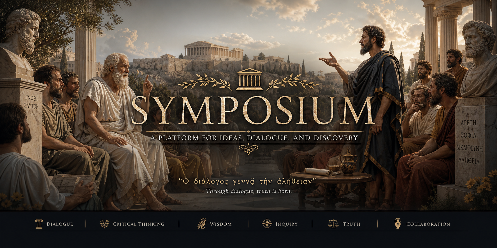
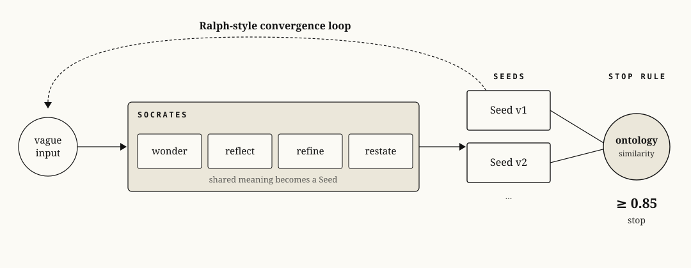
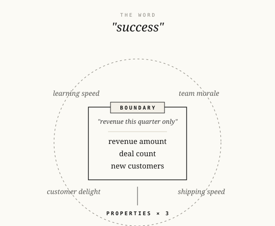

# Symposium



Turn vague AI requests into precise, testable specs.

Symposium is an open-source skill pack for agentic coding tools. It gives your AI assistant a Socratic interview loop that turns "I want a thing" into a closed **Seed**: goal, constraints, acceptance criteria, and semantic boundary.

Use it when a task is too fuzzy to implement safely, but too early for a full PRD.

Symposium is inspired by the interview layer of [Ouroboros](https://github.com/Q00/ouroboros), extracted into a small standalone skill pack for Codex and Claude. Ouroboros remains the larger workflow engine; Symposium focuses only on the pre-implementation step where user intent becomes shared meaning.

## A Real Example

I once asked an AI coding agent:

```text
Build me a mobile puzzle game.
```

Most coding tools would immediately choose Phaser, Unity, or another engine and start generating a game. The code would exist, but it would already be aimed at the wrong target.

After an interview, the real Seed was not "make one puzzle game." It was this:

```yaml
goal: Ship one mobile app every week. Observe each game for four weeks after launch and decide whether it crosses a 100,000 KRW revenue threshold. Reinvest only in hypotheses that pass the threshold.
constraints:
  - Keep the one-app-per-week shipping cadence.
  - Do not spend another cycle on apps with zero revenue.
  - Start with a mobile puzzle game, but choose the tech stack for shipping speed each cycle.
acceptance_criteria:
  - Record why each failed app failed and feed that into the next cycle.
  - Measure monthly side-income.
  - Maintain the weekly shipping cycle for at least 12 weeks.
  - Track installs and genre/category metrics for every app.
```

"Mobile puzzle game" was not just a game request.

It contained a one-year operating model.

The interview pulled out the implicit knowledge that was already in my head but not yet in the prompt: cadence, revenue threshold, reinvestment rules, failure logging, and the real reason the first game mattered.

```text
"Build a simple task CLI"
        |
        v
Wonder -> Reflect -> Refine -> Restate
        |
        v
Seed: goal + constraints + acceptance criteria
        |
        v
Evolve-step -> Ontology -> convergence
```



## Why People Use It

- **Less guessing**: the agent cannot silently invent missing requirements.
- **Better specs**: every vague request becomes a testable Seed.
- **Human control**: blind-spot config are never auto-adopted.
- **Works with Codex and Claude**: one canonical skill source, two install targets.
- **Small and hackable**: plain Markdown skills, no framework lock-in.

## Why Socratic Reasoning?

Most agent failures begin before code. The user says a word like "simple", "dashboard", "report", "success", or "mobile puzzle game"; the model silently fills that word with its own ontology and starts building.

Socratic reasoning slows the agent down at the exact point where guessing is most expensive:

1. **Wonder** asks what else the word could mean.
2. **Reflect** exposes the gap between user meaning and model meaning.
3. **Refine** turns that gap into shared meaning.
4. **Restate** converts shared meaning into a goal another person can execute.

The point is not to ask endless questions. The point is to make the agent earn the right to implement.

Modern coding models are already smart enough to build. The harder problem is deciding what their intelligence should point at. If the goal is not fixed, the model expands in the wrong direction. You still get code, but it is code for the wrong intention.

## Why Ontology?

A Seed says what should be done. An ontology says what the key words are allowed to mean.

Without ontology:

```text
"success" = revenue? retention? team morale? speed? quality?
```

With ontology:

```yaml
idea: success
boundary: revenue this quarter only
properties:
  - revenue amount
  - deal count
  - new customers
```



That boundary is what makes convergence possible. Symposium can compare two Seeds by comparing the ontology behind them. If two cycles still point to different boundaries, the loop continues. If they point to the same boundary, the agent can stop asking and start building.

## 60-Second Start

Clone the repo:

```bash
git clone <your-fork-or-repo-url> Symposium
cd Symposium
```

Install for Codex in this project:

```bash
./scripts/install.sh --target codex --scope project
```

Or install for Claude in this project:

```bash
./scripts/install.sh --target claude --scope project
```

Then ask your agent:

```text
Use interview-harness on: I want to build a simple task management CLI.
```

The agent will produce a final Seed shaped like:

```yaml
final_seed:
  goal: Build a local task management CLI for adding, listing, completing, and deleting tasks.
  constraints:
    - Runs locally without a database server.
    - Stores data in a human-readable file.
  acceptance_criteria:
    - A user can add a task from the command line.
    - A user can list open and completed tasks.
    - A user can mark a task complete.
  ontology:
    idea: Build a local task management CLI for adding, listing, completing, and deleting tasks.
    boundary: Personal local task tracking only; no team collaboration or cloud sync.
    properties:
      - task records
      - local persistence
      - command-line actions
cycles: 2
final_similarity: 0.91
stop_reason: convergence
```

## The Skill Pack

| Skill | What it does |
| --- | --- |
| `wonder` | Expands hidden meanings in a vague request. |
| `reflect` | Compares the user's intent with the model's interpretation. |
| `refine` | Merges meaning gaps into one shared meaning. |
| `restate` | Turns shared meaning into a one-line goal. |
| `socrates` | Orchestrates the first four skills into a Seed. |
| `evolve-step` | Reviews Seed blind spots and applies only user-approved changes. |
| `ontology` | Adds semantic boundary and properties on top of a Seed. |
| `interview-harness` | Runs the full convergence loop. |

## Install Options

Claude plugin marketplace install:

```bash
claude plugin marketplace add symposium https://github.com/Q00/Symposium
claude plugin install symposium@symposium
```

Project-local install:

```bash
./scripts/install.sh --target codex --scope project
./scripts/install.sh --target claude --scope project
```

Global install:

```bash
./scripts/install.sh --target codex --scope global
./scripts/install.sh --target claude --scope global
```

Install locations:

| Target | Project-local | Global |
| --- | --- | --- |
| Codex | `.codex/skills` | `~/.codex/skills` |
| Claude | `.claude/skills` | `~/.claude/skills` |

## Do I Need Separate Codex and Claude Skills?

No.

Symposium keeps one source of truth under `skills/`. The installer copies that source into the runtime-specific directory. The skills are written in neutral language:

- Codex Plan mode can use `request_user_input` when available.
- Claude can use `AskUserQuestion` when available.
- Any agent can fall back to normal conversational questions.

This keeps the open-source repo simple: edit once, install anywhere.

## Claude Plugin Marketplace

Symposium ships as its own Claude plugin marketplace package. It is intentionally not bundled into the Ouroboros marketplace: the goal is to keep Symposium lightweight, standalone, and easy to install without adopting the full Ouroboros workflow engine.

The plugin metadata lives under `.claude-plugin/`, modeled after the marketplace structure used by Ouroboros:

- `.claude-plugin/plugin.json`
- `.claude-plugin/marketplace.json`

The plugin manifest points Claude at the canonical `skills/` directory, so the marketplace package and the source skills stay in sync.

## Scratch Files

Runtime state is written to `.symposium/scratch/`:

- `.symposium/scratch/socrates.md`
- `.symposium/scratch/evolve-step.md`
- `.symposium/scratch/interview-harness.md`

Scratch files are ignored by git.

## Documentation

- [Getting Started](GETTING_STARTED.md)
- [Demo Seed](examples/task-cli.seed.yaml)
- [Contributing](CONTRIBUTING.md)
- [License](LICENSE)

## Example Output

See [examples/task-cli.seed.yaml](examples/task-cli.seed.yaml) for a complete Seed produced from:

```text
I want to build a simple task management CLI.
```

## Good First Use Cases

- Turning a vague feature idea into implementation-ready acceptance criteria.
- Interviewing a stakeholder before coding.
- Preventing an agent from over-assuming product scope.
- Creating compact specs for small tools, scripts, and prototypes.
- Teaching requirement refinement through a visible Socratic loop.

## Project Status

Symposium is intentionally small. The core goal is not to become a giant framework; it is to stay understandable enough that anyone can fork it and adapt the interview loop to their own team.

If this helps your agent ask better questions before writing code, give the repo a star and share a Seed that it helped clarify.

## License

MIT
